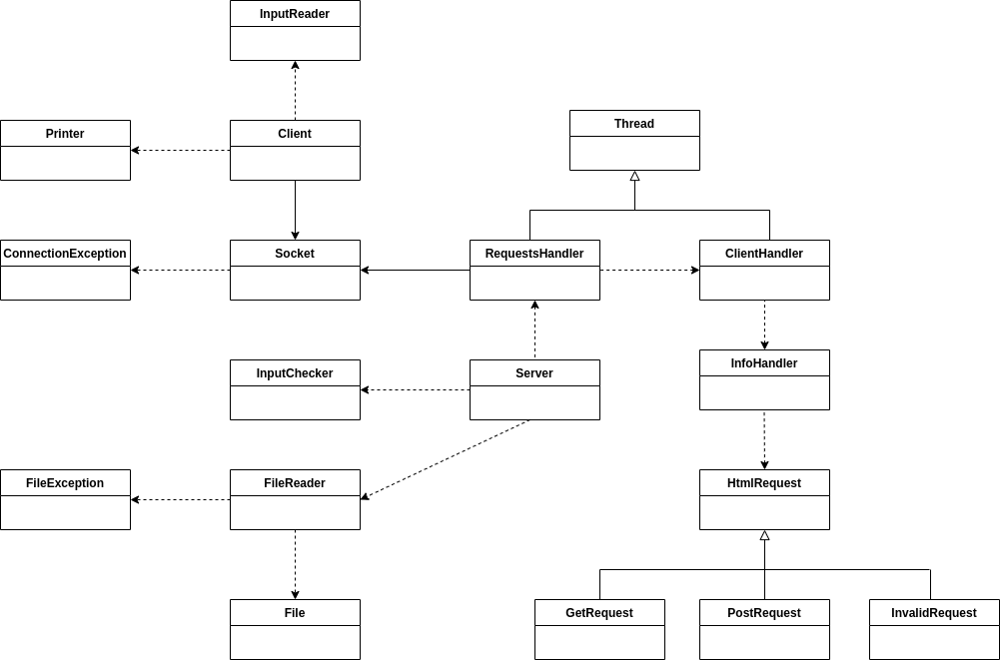
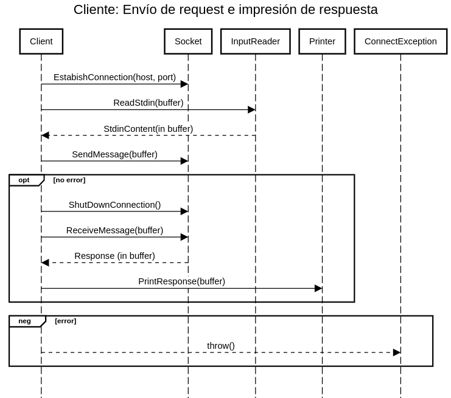
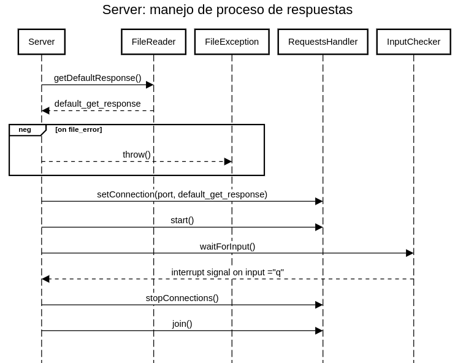
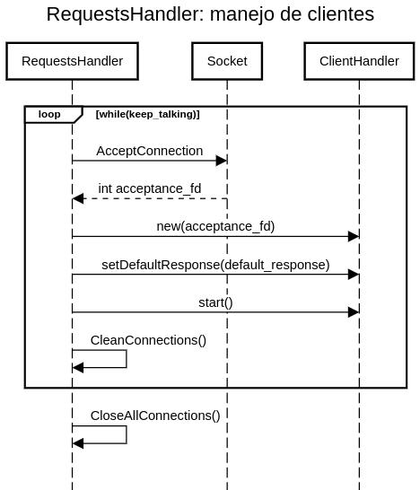
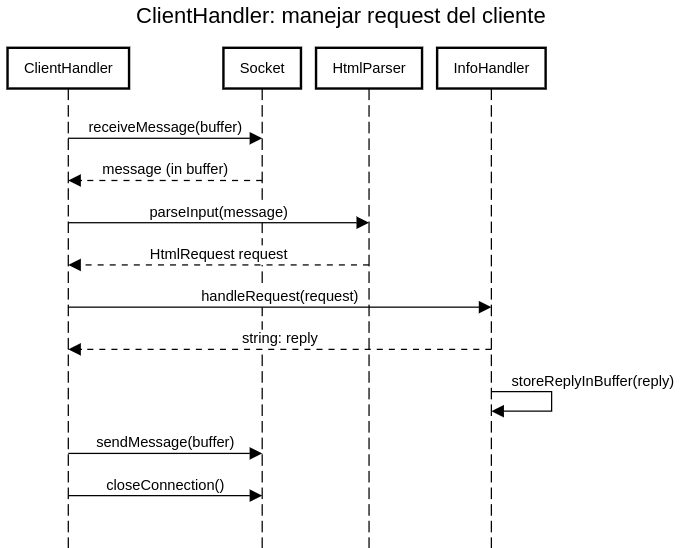

## **INFORME TP 3**

**Alumno:** Andrés Fernández

**Padrón:** 102220

**Link al repositorio:** https://github.com/andres912/Taller_TP3

### **DESCRIPCIÓN**

El siguiente diagrama de clases muestra a alto nivel los principales métodos y atributos de las clases:

En primera instancia, el funcionamiento del programa puede dividirse en dos componentes principales: el Cliente y el Servidor.

El funcionamiento del Cliente es bastante más sencillo, y se muestra en el siguiente diagrama:

El Cliente tiene instanciado un std::stringbuf buffer, el cual le envía a un InputReader para que le agregue el contenido de Stdin.

El Cliente también tiene instanciado un socket, al que, luego de tener el contenido del Stdin, le indicará que se conecte al host y puerto recibidos por parámetro, y que envíe el contenido del buffer al socket del Servidor. Luego de enviar el mensaje, el cliente indicará el shutdown del canal de escritura y reiniciará su buffer para que pueda almacenar de cero la respuesta del Servidor.

El socket del Cliente se quedará esperando la respuesta del Servidor. En cuanto la reciba, la guardará en el buffer que ya se encuentra limpio. En el caso de la respuesta, el encargado de cerrar el socket correspondiente es el socket del Servidor.

Si durante alguno de estos pasos, se lanzó una excepción ConnectionException, el Cliente la imprimirá por pantalla y retornará un 1.

Por último, el cliente le indicará a Printer que imprima la respuesta contenida en el buffer. Luego retornará 0.

El funcionamiento del Servidor es un poco más complejo, por la utilización de threads para el manejo de múltiples posibles clientes. Para facilitar la explicación, se divide el funcionamiento del Servidor en tres procesos, los cuales son ejecutados de forma concurrente:

1 - El proceso del Servidor es ejecutado en el main_thread del programa. La secuencia es relativamente simple:

El Servidor le indica al FileReader que abra el archivo info_file recibido por parámetro, y que de ahí obtenga la que será la respuesta por defecto para las GetRequests. Si en este paso el FileReader lanza una FileException, el Servidor la atrapa y retorna 1.

El Servidor luego crea un RequestsHandler (descendiente de Thread), al cual inicializa con el puerto recibido por parámetro y la respuesta por defecto obtenida anteriormente. Se lanza un nuevo thread, que será en el cual el RequestsHandler se ocupe de atender las requests que vayan llegando.

Mientras eso sucede, el main_thread continua con el Servidor indicándole al InputChecker que le avise en cuanto el usuario ingresa una "q" por teclado. Si durante este proceso, en el cual de forma concurrente se están atendiendo consultas, se lanza una ConnectionException, el Servidor la atrapa, cambia el valor a retornar a 1, y continúa al siguiente paso.

En el último paso, se haya lanzado o no una ConnectionException, el Servidor le indica al RequestsHandler que cierre cualquier conexión que haya quedado abierta a través de stopConnections(), y luego hace un join del thread. Finalmente, se devuelve el valor de retorno, 0 o 1, de acuerdo a sí el proceso se realizó de forma correcta.

2 - El RequestsHandler inicia su proceso durante el desarrollo del main_thread, y se encarga de atender las requests que van llegando de la siguiente forma:

El RequestsHandler le indica al socket que tiene instanciado que inicialice la conexión con el puerto recibido al inicilizarse y que haga el listen correspondiente.

Mientras que su variable booleana interna, keep_talking, siga siendo true, el RequestsHandler hace lo siguiente:

El RequestsHandler le solicita al socket que acepte una conexión. En cuanto un cliente establezca una conexión, el socket le devuelve al RequestHandler el número de socket_fd que corresponderá a la comunicación con ese cliente.

El RequestsHandler inicializará, con este número de file descriptor, un puntero a ClientHandler (descendiente de Thread). Luego, agregará este puntero a su vector instanciado "clients" y le indicará que comience su ejecución. Si, durante la ejecución del ClientHandler surge una ConnectionException, se la atŕapará y se cortará el ciclo en cuestión.

La ejecución del thread actual continuará con la limpieza de recursos: el RequestHandler recorrerá su vector de ClientThreads, consultará si finalizaron su ejecución y, de haberlo hecho, se harán el correspondiente join, delete y eliminación del ClientThread del vector.

Este ciclo mantiene su ejecución hasta que, o bien el el socket devuelve un -1 en el accept, o, de forma más improbable, keep_talking sea false. Esto último es más improbable porque implicaría que el usuario ingresó una "q" en los milisegundos en los que la ejecución del RequestHandler no se encuentra bloqueada por el accept. De cualquiera de las dos maneras, se sale del ciclo y se llama a la función propia closeConnections. Hasta el momento, no se contemplan posibles errores en la ejecución, más allá del arriba mencionado.

El RequestHandler ejecuta la función closeConnections o bien por indicación del Servidor, cuando se ingresa una "q" por Stdin, o por un error de conexión. Lo primero que se hace, en ambos casos, es definitivamente cerrar cualquier ClientThread que haya quedado en el vector "clients". En este caso, la conexión del cliente se cierra a la fuerza en lugar de preguntar al ClientThread si finalizó su ejecución, mediante la función stop(). Luego, se realizan el join y delete correspondientes.

Por último, luego de cerrar todos los threads abiertos, el RequestHandler verifica su variable keep_talking. Un valor false de la variable implica que las conexiones se cerraron por indicación del usuario, por lo que el proceso se realizó de forma correcta y se debe salir de forma normal. Un valor true indica que una de las conexiones con un cliente fue defectuosa, por lo que se lanza una excepción de tipo ConnectionException. De alguna de estas dos maneras, se finaliza la ejecución del RequestsHandler.

3 - Los ClientHandlers son threads lanzados por el RequestHandler para encargarse de la recepción de requests y envío de respuestas a los clientes.

En su creación, el ClientHandler ya le había indicado al socket que tiene instanciado cuál será el file descriptor correspondiente a su comunicación con el cliente (el cual había recibido por parámetro).

El ClientHandler inicia su ejecución indicándole a su socket que reciba el mensaje del Cliente en su buffer (std::stringbuf) instanciado.

El ClientHandler le indicará a su HtmlParser que, a partir del mensaje recibido, cree una HtmlRequest. Luego, le enviará esa HtmlRequest al InfoHandler, que será quien se encargué de devolver la respuesta correspondiente al Client Handler. Además, el ClientHandler se guardará el header de la Request ya que luego deberá imprimirlo por pantalla.

Una vez que tiene la respuesta a enviar, el ClientHandler la carga en su buffer (antes lo reinicia) y lo envía a su socket para que se encarge de reenviarle la respuesta al socket del Cliente. Luego le indicará al socket que haga el shutdown y close del socket_fd correspondiente.

Por último, el Cliente imprime el encabezado de la request recibida por pantalla, y finaliza su ejecución.

### **COMENTARIOS**

Las principales dificultades que presentó el trabajo fueron:

* La introducción de un nuevo lenguaje que de por sí es bastante complejo como C++, y el hecho de pasar de un lenguaje de programación estructurada a uno orientado a objetos (aunque en el TP 1 básicamente se buscó simular una orientación a objetos).

* La complejidad propia de C++ en cuanto a referencias, punteros, move semantics, etc. Principalmente fue complicado tener que dejar de usar punteros para darle prioridad a las referencias, teniendo en cuenta las restricciones propias de las referencias (no pueden ser NULL, no pueden declararse sin definirse...).

* Entender las cuestiones básicas del funcionamiento de los threads. Es un tema completamente nuevo y, aunque se nota que lo pedido en este TP es relativamente básico, entender bien cómo funcionan los threads, los mutex y los locks tiene su complejidad.

* Respetar lós conceptos de la orientación a objetos, en cuanto a la lógica de la abstracción de los objetos, no sobrecargar a un sólo objeto con muchas responsabilidades, tratar de tener alta cohesión y baja dependencia.

* Lo resultante de mezclar todo lo anterior. Por ejemeplo, en un momento quise pasar por referencia a los repositorios al objeto Validador, para que los tuviera como atributos. Pero cuando quería guardarlos, no podía utilizar el operador =. Los repositorios tenían como atributo un mutex, lo que destruía el operador = por defecto. Quise sobrecargar el operador = de los repositorios, pero no sabía cómo hacer para pasar el mutex al nuevo objeto dentro de la sobrecarga. Finalmente, decidí dos cosas: que los repositorios no tuvieran un mutex como atributo, ya que lo usaban en un sólo método, y que el Validador tampoco tuviera a los repositorios como atributos, sino que se pasaran dentro de un sólo método. Podría haber hecho una sola de estas dos cosas, pero me pareció que tenía más sentido hacer ambos cambios.

