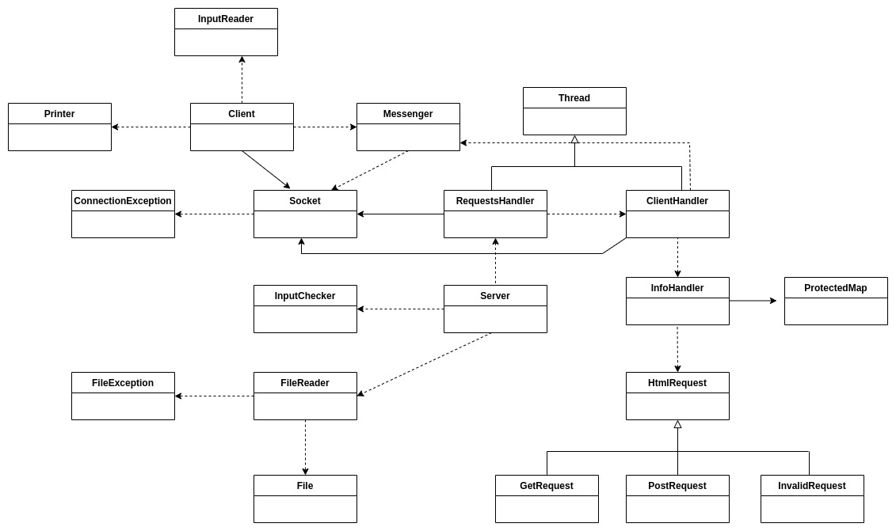

## **INFORME TP 3**

**Alumno:** Andrés Fernández

**Padrón:** 102220

**Link al repositorio:** https://github.com/andres912/Taller_TP3

### **MODIFICACIONES DE LA REENTREGA**

Nuevo diagrama de clases:

* Mutex: se redujo la sección crítica del código: en lugar de envolver todo el procesos de comunicación del ClientHandler (todo el proceso de recibir la HtmlRequest y responder), se focalizó la sección crítica en las acciones relacionadas a obtener y guardar un recurso, y a la de imprimir el resultado por pantalla del lado del Servidor. Para eso, se creó la clase ProtectedMap y se modificó la clase Printer para que utilice un mutex.

* Sockets: se modificó totalmente el funcionamiento de los sockets, de acuerdo al siguiente diagrama:

La idea detrás de esto fue dividir el comportamiento de los sockets de una forma más específica de acuerdo al alcance de sus funciones. El socket del Cliente se encarga tanto de la conexión como de la comunicación con otros sockets, mientras que el Servidor tiene las funciones de conexión y comunicación divididas entre dos sockets. Usé la herramienta de herencia múltiple de C++ (en este caso, usé herencia virtual). Esto me permitió ordenar un poco las funciones de los sockets y hacer el código menos confuso.

* Encapsulamiento: la función de aceptación que tiene el ServerSocket, como muestra el diagrama, ahora crea, con el resultado de la función accept, un nuevo AcceptanceSocket que sólo se encarga de comunicarse con otros sockets. De esta forma, evito romper el encapsulamiento de la clase, ya que el manejo del socket_fd se mantiene dentro de los sockets. Para pasar este socket del RequestsHandeler a cada ClientHandler utilizo **std::move**.

* Strings y buffers: ahora delego la comunicación entre Cliente y Servidor a una clase denominada Messenger. A los Messengers les sigo pasando un buffer (ahora, std::stringstream), pero ahora lo que reciben los sockets para comunicarse son vectores **const char**, con su correspondiente tamaño, lo cual flexibiliza su uso. Los Messengers envían y reciben mensajes en *chunks* de 64 bytes.

* Otros cambios menores, de acuerdo a la revisión.

### **DESCRIPCIÓN**

El siguiente diagrama de clases muestra a alto nivel los principales métodos y atributos de las clases:

En primera instancia, el funcionamiento del programa puede dividirse en dos componentes principales: el Cliente y el Servidor.

El funcionamiento del Cliente es bastante más sencillo, y se muestra en el siguiente diagrama:

El Cliente tiene instanciado un std::stringbuf buffer, el cual le envía a un InputReader para que le agregue el contenido de Stdin.

El Cliente también tiene instanciado un socket, al que, luego de tener el contenido del Stdin, le indicará que se conecte al host y puerto recibidos por parámetro, y que envíe el contenido del buffer al socket del Servidor. Luego de enviar el mensaje, el cliente indicará el shutdown del canal de escritura y reiniciará su buffer para que pueda almacenar de cero la respuesta del Servidor.

El socket del Cliente se quedará esperando la respuesta del Servidor. En cuanto la reciba, la guardará en el buffer que ya se encuentra limpio. En el caso de la respuesta, el encargado de cerrar el socket correspondiente es el socket del Servidor.

Si durante alguno de estos pasos, se lanzó una excepción ConnectionException, el Cliente la imprimirá por pantalla y retornará un 1.

Por último, el cliente le indicará a Printer que imprima la respuesta contenida en el buffer. Luego retornará 0.

El funcionamiento del Servidor es un poco más complejo, por la utilización de threads para el manejo de múltiples posibles clientes. Para facilitar la explicación, se divide el funcionamiento del Servidor en tres procesos, los cuales son ejecutados de forma concurrente:

1 - El proceso del Servidor es ejecutado en el main_thread del programa. La secuencia es relativamente simple:

El Servidor le indica al FileReader que abra el archivo info_file recibido por parámetro, y que de ahí obtenga la que será la respuesta por defecto para las GetRequests. Si en este paso el FileReader lanza una FileException, el Servidor la atrapa y retorna 1.

El Servidor luego crea un RequestsHandler (descendiente de Thread), al cual inicializa con el puerto recibido por parámetro y la respuesta por defecto obtenida anteriormente. Se lanza un nuevo thread, que será en el cual el RequestsHandler se ocupe de atender las requests que vayan llegando.

Mientras eso sucede, el main_thread continua con el Servidor indicándole al InputChecker que le avise en cuanto el usuario ingresa una "q" por teclado. Si durante este proceso, en el cual de forma concurrente se están atendiendo consultas, se lanza una ConnectionException, el Servidor la atrapa, cambia el valor a retornar a 1, y continúa al siguiente paso.

En el último paso, se haya lanzado o no una ConnectionException, el Servidor le indica al RequestsHandler que cierre cualquier conexión que haya quedado abierta a través de stopConnections(), y luego hace un join del thread. Finalmente, se devuelve el valor de retorno, 0 o 1, de acuerdo a sí el proceso se realizó de forma correcta.

2 - El RequestsHandler inicia su proceso durante el desarrollo del main_thread, y se encarga de atender las requests que van llegando de la siguiente forma:

El RequestsHandler le indica al socket que tiene instanciado que inicialice la conexión con el puerto recibido al inicilizarse y que haga el listen correspondiente.

Mientras que su variable booleana interna, keep_talking, siga siendo true, el RequestsHandler hace lo siguiente:

El RequestsHandler le solicita al socket que acepte una conexión. En cuanto un cliente establezca una conexión, el socket le devuelve al RequestHandler el número de socket_fd que corresponderá a la comunicación con ese cliente.

El RequestsHandler inicializará, con este número de file descriptor, un puntero a ClientHandler (descendiente de Thread). Luego, agregará este puntero a su vector instanciado "clients" y le indicará que comience su ejecución. Si, durante la ejecución del ClientHandler surge una ConnectionException, se la atŕapará y se cortará el ciclo en cuestión.

La ejecución del thread actual continuará con la limpieza de recursos: el RequestHandler recorrerá su vector de ClientThreads, consultará si finalizaron su ejecución y, de haberlo hecho, se harán el correspondiente join, delete y eliminación del ClientThread del vector.

Este ciclo mantiene su ejecución hasta que, o bien el el socket devuelve un -1 en el accept, o, de forma más improbable, keep_talking sea false. Esto último es más improbable porque implicaría que el usuario ingresó una "q" en los milisegundos en los que la ejecución del RequestHandler no se encuentra bloqueada por el accept. De cualquiera de las dos maneras, se sale del ciclo y se llama a la función propia closeConnections. Hasta el momento, no se contemplan posibles errores en la ejecución, más allá del arriba mencionado.

El RequestHandler ejecuta la función closeConnections o bien por indicación del Servidor, cuando se ingresa una "q" por Stdin, o por un error de conexión. Lo primero que se hace, en ambos casos, es definitivamente cerrar cualquier ClientThread que haya quedado en el vector "clients". En este caso, la conexión del cliente se cierra a la fuerza en lugar de preguntar al ClientThread si finalizó su ejecución, mediante la función stop(). Luego, se realizan el join y delete correspondientes.

Por último, luego de cerrar todos los threads abiertos, el RequestHandler verifica su variable keep_talking. Un valor false de la variable implica que las conexiones se cerraron por indicación del usuario, por lo que el proceso se realizó de forma correcta y se debe salir de forma normal. Un valor true indica que una de las conexiones con un cliente fue defectuosa, por lo que se lanza una excepción de tipo ConnectionException. De alguna de estas dos maneras, se finaliza la ejecución del RequestsHandler.

3 - Los ClientHandlers son threads lanzados por el RequestHandler para encargarse de la recepción de requests y envío de respuestas a los clientes.

En su creación, el ClientHandler ya le había indicado al socket que tiene instanciado cuál será el file descriptor correspondiente a su comunicación con el cliente (el cual había recibido por parámetro).

El ClientHandler inicia su ejecución indicándole al Messenger que reciba el mensaje del Cliente en su buffer (std::stringstream) instanciado.

El ClientHandler le indicará a su HtmlParser que, a partir del mensaje recibido, cree una HtmlRequest. Luego, le enviará esa HtmlRequest al InfoHandler, que será quien se encargué de devolver la respuesta correspondiente al Client Handler. Además, el ClientHandler se guardará el header de la Request ya que luego deberá imprimirlo por pantalla.

Una vez que tiene la respuesta a enviar, el ClientHandler la carga en su buffer (antes lo reinicia) y lo envía a su socket para que se encarge de reenviarle la respuesta al socket del Cliente. Luego le indicará al socket que haga el shutdown y close del socket_fd correspondiente.

Por último, el Cliente imprime el encabezado de la request recibida por pantalla, y finaliza su ejecución.

### **COMENTARIOS**

Las principales dificultades que presentó el trabajo fueron:

* El pasaje de la modelización de los Clientes y Servidores de C a C++. Si bien cuando lo hicimos en C, lo hicimos relativamente orientado a objetos, el pasaje a C++ tuvo sus dificultades, principalmente a la hora de determinar si era o no conveniente seguir usando o no el heap, y a la hora de decidir la forma de enviar los mensajes por el buffer. Utilicé para esto la clase std::stringbuf, pero me encontré con algunas limitaciones en el camino. Obviamente, esto no fue más difícil del trabajo, pero sí me tomó más tiempo del que había previsto.

* Seguir adaptándome a las cuestiones propias de C++: referencias, movimiento, copia. Seguí utilizando, como había hecho en C, punteros a las funciones bind y connect en los sockets porque no tuve tiempo de probar functors. Sobrecargar el operador () terminó siendo relativamente fácil, aunque no sé si lo hice de acuerdo a lo que se esperaba.

* La parte más difícil fue la relacionada al manejo de multithreads. Yo había implementado en C a cada Server para que tuviera instanciados dos sockets, el de conexión y el aceptador, por lo que para este TP tuve que cambiar esa lógica que no podía adaptarse a lo pedido por el enunciado. Es mucho más difícil tratar de seguir un proceso que tiene más de un thread que uno que sólo tiene uno, aunque el debugger de CLion me ayudó bastante.

